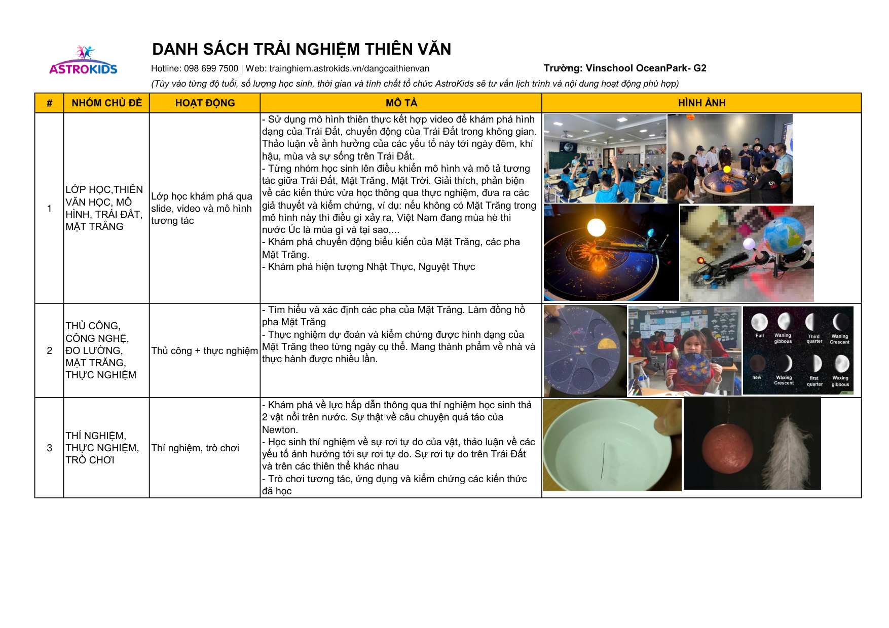

# NỘI DUNG TỔNG HỢP

> File tổng hợp tự động từ:
> - `Mota trainghiem_G2.pdf`
> - `Noi dung hoc tap.docx`

---

## PHẦN 1 — MÔ TẢ TRẢI NGHIỆM G2 (PDF)

> **Ảnh các trang PDF:**
- 

---

### Trang 1

DANH SÁCH TRẢI NGHIỆM THIÊN VĂN
Hotline: 098 699 7500 | Web: trainghiem.astrokids.vn/dangoaithienvan
Trường: Vinschool OceanPark- G2
(Tùy vào từng độ tuổi, số lượng học sinh, thời gian và tính chất tổ chức AstroKids sẽ tư vấn lịch trình và nội dung hoạt động phù hợp)
#
NHÓM CHỦ ĐỀ
HOẠT ĐỘNG
MÔ TẢ
HÌNH ẢNH
1
LỚP HỌC,THIÊN 
VĂN HỌC, MÔ 
HÌNH, TRÁI ĐẤT, 
MẶT TRĂNG
Lớp học khám phá qua 
slide, video và mô hình 
tương tác
- Sử dụng mô hình thiên thực kết hợp video để khám phá hình 
dạng của Trái Đất, chuyển động của Trái Đất trong không gian. 
Thảo luận về ảnh hưởng của các yếu tố này tới ngày đêm, khí 
hậu, mùa và sự sống trên Trái Đất. 
- Từng nhóm học sinh lên điều khiển mô hình và mô tả tương 
tác giữa Trái Đất, Mặt Trăng, Mặt Trời. Giải thích, phản biện 
về các kiến thức vừa học thông qua thực nghiệm, đưa ra các 
giả thuyết và kiểm chứng, ví dụ: nếu không có Mặt Trăng trong 
mô hình này thì điều gì xảy ra, Việt Nam đang mùa hè thì 
nước Úc là mùa gì và tại sao,...
- Khám phá chuyển động biểu kiến của Mặt Trăng, các pha 
Mặt Trăng.
- Khám phá hiện tượng Nhật Thực, Nguyệt Thực
2
THỦ CÔNG, 
CÔNG NGHỆ, 
ĐO LƯỜNG, 
MẶT TRĂNG, 
THỰC NGHIỆM
Thủ công + thực nghiệm
- Tìm hiểu và xác định các pha của Mặt Trăng. Làm đồng hồ 
pha Mặt Trăng
- Thực nghiệm dự đoán và kiểm chứng được hình dạng của 
Mặt Trăng theo từng ngày cụ thể. Mang thành phẩm về nhà và 
thực hành được nhiều lần.
3
THÍ NGHIỆM, 
THỰC NGHIỆM, 
TRÒ CHƠI
Thí nghiệm, trò chơi
- Khám phá về lực hấp dẫn thông qua thí nghiệm học sinh thả 
2 vật nổi trên nước. Sự thật về câu chuyện quả táo của 
Newton.
- Học sinh thí nghiệm về sự rơi tự do của vật, thảo luận về các 
yếu tố ảnh hưởng tới sự rơi tự do. Sự rơi tự do trên Trái Đất 
và trên các thiên thể khác nhau
- Trò chơi tương tác, ứng dụng và kiểm chứng các kiến thức 
đã học

---

## PHẦN 2 — NỘI DUNG HỌC TẬP (DOCX)

Bài. Lực hấp dẫn:
MTB 6.2.a: Học sinh nêu được khái niệm lực hấp dẫn và giải thích tác dụng của lực hấp dẫn. MTB 6.2.e: Học sinh tiến hành được thực nghiệm kiểm chứng độ rơi nhanh/chậm của vật có trọng lượng khác nhau một cách an toàn.
[SCI2-Unit7] Trái Đất, Mặt Trời và Mặt Trăng  Hình dạng của Trái Đất, Mặt Trăng và Mặt Trời
Mặt Trăng  Các pha của Mặt Trăng
MTC 7.a: 6.1.1 Học sinh mô tả được hình dạng của Trái Đất, Mặt Trời và Mặt Trăng.
MTC 7.b: 6.1.2 Học sinh giải thích được lý do tại sao Trái Đất, Mặt Trời và Mặt Trăng có hình dạng giống nhau.
MTC 7.c: 6.1.3 Học sinh liệt kê được những loại nghiên cứu khoa học cần sử dụng để tìm hiểu về Trái Đất, Mặt Trăng và Mặt Trời.
MTC 7.d: 6.1.4 Học sinh nghiên cứu được hình dạng và sự chuyển động của Trái Đất, Mặt Trời và Mặt Trăng.
Đã liên kết với 2 Mục tiêu bài học , 1 Chuẩn chuyên môn , 1 Chuẩn liên môn , 0 Mốc đánh giá
MTC MTC 7.e: 6.1.5 Học sinh sử dụng được mô hình để mô phỏng lực hấp dẫn biến các vật thành hình cầu như thế nào.
MTC 7.f: 6.2.1 Học sinh mô tả được chuyển động của Mặt Trăng.
MTC 7.g: 6.2.2 Học sinh trình bày được các mô hình khác nhau biểu diễn kích thước và chuyển động của Mặt Trăng.
Đây là nội dung học tập mà e muốn nhờ bên a tổ chức trải nghiệm cho HS
Khối của em có 12 lớp
chia cho 4 tiết buổi sáng (2 ca) Ca 1: 8:00 - 9:20 (6 lớp) Ca 2: (9:30 - 10:45) (6 lớp)
8h5-8h40
8h45-9h20
9h30-10h05
10h10-10h45
------
Gồm 2 hoạt động: lớp học khám phá và thủ công + thí nghiệm. Mỗi hoạt động tương ứng với 1 tiết 40’ gồm cả di chuyển và ổn định.
1. Lớp học khám phá qua slide, video và mô hình tương tác:
- Hình dạng của Trái Đất, chuyển động của Trái Đất trong không gian. Ảnh hưởng của hình dạng và chuyển động này tới ngày đêm, khí hậu, mùa và sự sống trên Trái Đất. Chuyển động biểu kiến của Mặt Trăng, các pha Mặt Trăng. Tương tác giữa Trái Đất, Mặt Trăng, Mặt Trời. (sử dụng mô hình thiên thực)
- Hiện tượng Nhật Thực, Nguyệt Thực
2. Thủ công + thí nghiệm, thực nghiệm:
- Tìm hiểu và xác định các pha của Mặt Trăng. Làm đồng hồ pha Mặt Trăng, thực nghiệm dự đoán được hình dạng của Mặt Trăng theo từng ngày cụ thể. Mang thành phẩm về nhà và thực hành được nhiều lần.
- Thí nghiệm về lực hấp dẫn (lá cây hút nhau)
- Thí nghiệm về sự rơi tự do của vật (thả vật)
